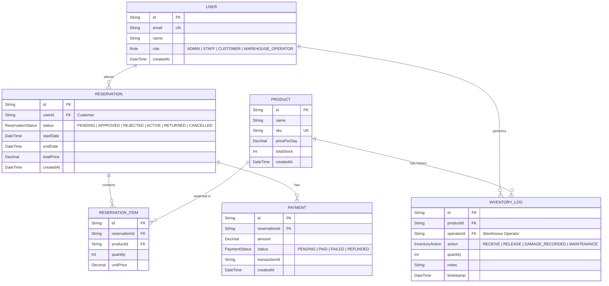

# ERP Database Entity Relationship Diagram (ERD)

## Interactive Mermaid Diagram

## Entities & Enums Summary

| Enum Name | Options | Main Entity Bound |
| :--- | :--- | :--- |
| `Role` | `ADMIN`, `STAFF`, `CUSTOMER`, `WAREHOUSE_OPERATOR` | `User.role` |
| `ReservationStatus` | `PENDING`, `APPROVED`, `REJECTED`, `ACTIVE`, `RETURNED`, `CANCELLED` | `Reservation.status` |
| `PaymentStatus` | `PENDING`, `PAID`, `FAILED`, `REFUNDED` | `Payment.status` |
| `InventoryAction` | `RECEIVE`, `RELEASE`, `DAMAGE_RECORDED`, `MAINTENANCE` | `InventoryLog.action` |
