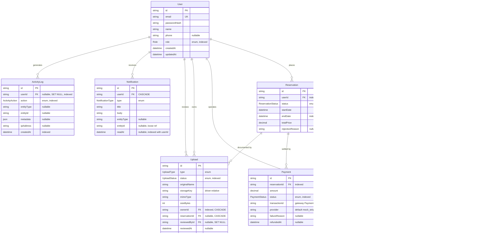
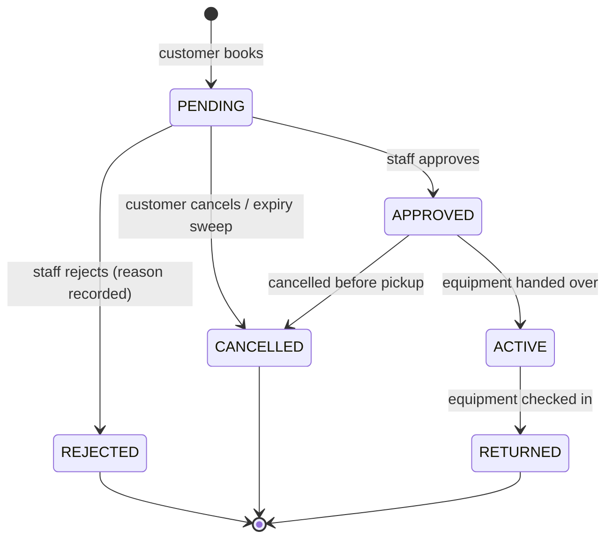

# AmmuNation ERP — Database Entity Relationship Diagram

Generated from `backend/prisma/schema.prisma`, which remains the source of truth.
Rendered natively by GitHub, VS Code (Mermaid preview) and mermaid.live — no external
image asset is required.

**10 models · 8 enums.** Roles are an enum on `User.role`, not a join table, because a user
holds exactly one role.

---

## Entity Relationship Diagram

---

## Enumerations

| Enum | Values |
|---|---|
| `Role` | `ADMIN`, `STAFF`, `CUSTOMER`, `WAREHOUSE_OPERATOR` |
| `ReservationStatus` | `PENDING`, `APPROVED`, `REJECTED`, `ACTIVE`, `RETURNED`, `CANCELLED` |
| `PaymentStatus` | `PENDING`, `PAID`, `FAILED`, `REFUNDED` |
| `InventoryAction` | `RECEIVE`, `RELEASE`, `DAMAGE_RECORDED`, `MAINTENANCE` |
| `UploadType` | `IDENTITY_DOCUMENT`, `RENTAL_AGREEMENT`, `EQUIPMENT_IMAGE` |
| `UploadStatus` | `PENDING_REVIEW`, `VERIFIED`, `REJECTED` |
| `NotificationType` | `RESERVATION_APPROVED`, `RESERVATION_REJECTED`, `UPCOMING_RETURN`, `RESERVATION_EXPIRED`, `PAYMENT_RECEIVED`, `DOCUMENT_VERIFIED` |
| `ActivityAction` | `LOGIN`, `RESERVATION_CREATED`, `RESERVATION_UPDATED`, `PAYMENT_PROCESSED`, `PAYMENT_REFUNDED`, `INVENTORY_CHANGED`, `DOCUMENT_UPLOADED`, `DOCUMENT_REVIEWED` |

---

## Reservation state machine

Enforced server-side in `ReservationsService.validateStatusTransition`; illegal transitions
return `400`.

---

## Referential integrity notes

- **`Product.categoryId` → `SET NULL`.** Deleting a category leaves its equipment intact and
  uncategorised rather than cascading the products away.
- **`Upload.ownerId` / `Upload.reservationId` → `CASCADE`.** Documents are meaningless once
  their owner or reservation is gone.
- **`ActivityLog.userId` → `SET NULL`.** The audit trail deliberately survives account
  deletion; entries are retained with a null actor.
- **`Notification.userId` → `CASCADE`.** A deleted account's feed is removed with it.
- **`ReservationItem.unitPrice`** stores the price at the moment of booking, so later catalog
  price changes never rewrite historical order totals.
